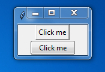
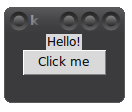

# Getting Started

Tkinter is a wrapper around a GUI toolkit called Tk. It's usually used
through a language called Tcl, but tkinter allows us to use Tcl and Tk
through Python. This means that we can use Tcl's libraries like Tk with
Python without writing any Tcl code.

## Installing tkinter

**If you installed Python yourself you already have tkinter.** If you
are using Linux you probably don't, but you can install tkinter with
your distribution's package manager. For example, you can use this
command on Debian-based distributions, like Ubuntu and Mint:

```
sudo apt install python3-tk
```

## Hello World!

That's enough talking. Let's do the classic Hello World program :)

[include]: # (hello-world-tk.py)
```python
import tkinter

root = tkinter.Tk()
label = tkinter.Label(root, text="Hello World!")
label.pack()
root.mainloop()
```

Run this program like any other program. It should display a tiny window
with the text `Hello World!` in it. I'm way too lazy to take
screenshots, so here's some ASCII art:

```
,------------------.
| tk   | _ | o | X |
|------------------|
|   Hello World!   |
`------------------'
```

There are many things going on in this short code. Let's go through it
line by line.

```python
import tkinter
```

Many other tkinter tutorials use `from tkinter import *` instead, and then they
use things like `Label` instead of `tk.Label`. **Don't use star imports.** It
will confuse you and other people. You can't be sure about where `Label` comes
from if the file is many lines long, but many tools that process code
automatically will also be confused. Overall, star imports are evil.

Some people like to do `import tkinter as tk` and then use `tk.Label` instead
of `tkinter.Label`. There's nothing wrong with that, and you can do that too if
you want to. It's also possible to do `from tkinter import Tk, Label, Button`,
which feels a little bit like a star import to me, but it's definitely not as
bad as a star import.

```python
root = tkinter.Tk()
```

The root window is the main window of our program. In this case, it's
the only window that our program creates. Tkinter starts Tcl when you
create the root window.

```python
label = tkinter.Label(root, text="Hello World!")
```

Like most other GUI toolkits, Tk uses **widgets**. A widget is something
that we see on the screen. Our program has two widgets. The root window
is a widget, and this label is a widget. A label is a widget that just
displays text.

Note that most widgets take a **parent widget** as the first argument.
When we do `tk.Label(root)`, the root window becomes the parent so the
label will be displayed in the root window.

```python
label.pack()
```

This adds the label into the root window so we can see it.

Instead of using a `label` variable, you can also do this:

```python
tkinter.Label(root, text="Hello World!").pack()
```

But don't do this:

```python
label = tkinter.Label(root, text="Hello World!").pack()   # this is probably a mistake
```

Look carefully, the above code creates a label, packs it, and then sets a
`label` variable to whatever the `.pack()` returns. That is not same as the
label widget. It is `None` because most functions return `None` when they don't
need to return anything more meaningful (I have written more about this
[here][pytut-return-values]), so you'll get errors like
`NoneType object something something` when you try to use the `label` (see
[here][pytut-none]).

[pytut-return-values]: https://github.com/Akuli/python-tutorial/blob/master/basics/using-functions.md#return-values
[pytut-none]: https://github.com/Akuli/python-tutorial/blob/master/basics/variables.md#none

Anyway... let's continue going through the lines of our example code.

```python
root.mainloop()
```

The code before this takes usually just a fraction of a second to run,
but this line of code runs until we close the window. It's usually
something between a few seconds and a few hours.

## Hello Ttk!

There is a Tcl library called Ttk, short for "themed tk". I'll show you why you
should use it instead of the non-Ttk code soon.

The `tkinter.ttk` module contains things for using Ttk with Python. Here is a
tkinter program that displays two buttons that do nothing when they are
clicked. One of the buttons is a Ttk button and the other isn't.

[include]: # (why-ttk.py)
```python
import tkinter
from tkinter import ttk

root = tkinter.Tk()
tkinter.Button(root, text="Click me").pack()
ttk.Button(root, text="Click me").pack()
root.mainloop()
```

The GUI looks like this on Windows 7:



The ttk button is the one that looks a lot better. Tk itself is very old, and
its button widget is probably just as old, and it looks very old too. Ttk
widgets look much better in general, and you should *always* use Ttk widgets.
tl;dr: **Use ttk.**

If you already have some code that doesn't use Ttk widgets, you just need to
add `from tkinter import ttk` and then replace `tkinter.SomeWidget` with
`ttk.SomeWidget` everywhere. Most things will work just fine.

Unfortunately writing Ttk code is kind of inconvenient because there's no way
to create a root window that uses Ttk. Some people just create a Tk root
window and add things to that, e.g. like this:

[include]: # (ttk-label-button-broken.py)
```python
import tkinter
from tkinter import ttk

root = tkinter.Tk()
ttk.Label(root, text="Hello!").pack()
ttk.Button(root, text="Click me").pack()
root.mainloop()
```

GUIs like this look horrible on my Linux system.



```
<xqb>   woa it sak balz :|
```

The background of this root window is not using Ttk, so it has *very* different
colors than the Ttk widgets. We can fix that by adding a big Ttk frame to the
Tk root window. A frame is an empty widget, and we can add any other widgets we
want inside a frame. If we add a `ttk.Frame` to the root window and pack it
with `fill='both', expand=True`, it will always fill the entire window, making
the window look like a Ttk widget. **I'll do this in all examples from now on.**

```python
root = tkinter.Tk()
big_frame = ttk.Frame(root)
big_frame.pack(fill='both', expand=True)
# now add all widgets to big_frame instead of root
```

This is annoying, but keep in mind that you only need to do this once for each
window; in a big project you typically have many widgets inside each window,
and this extra boilerplate doesn't annoy that much after all.

Here is a complete hello world program. It shouldn't look too horrible on
anyone's system.

[include]: # (hello-world.py)
```python
import tkinter
from tkinter import ttk

root = tkinter.Tk()
big_frame = ttk.Frame(root)
big_frame.pack(fill='both', expand=True)

label = ttk.Label(big_frame, text="Hello World!")
label.pack()
root.mainloop()
```

## Tkinter and the `>>>` prompt

The `>>>` prompt is a great way to experiment with things. You can also
experiment with tkinter on the `>>>` prompt, but unfortunately it
doesn't work that well on all platforms. Everything works great on
Linux, but on Windows the root window is unresponsive when
`root.mainloop()` is not running.

Try the hello world example on the `>>>` prompt, just type it there line
by line. It's really cool to see the widgets appearing on the screen as
you type. If this works on your system, that's great! If not,
you can run `root.update()` regularly to make it display your changes.

## Print issues

If you try to print a tkinter widget, the results can be surprising.

[comment]: # (github screws up with syntax highlighting here)

```
>>> print(label)
.!label
```

Doing the same thing looks roughly like this on Python 3.5 and older:

```python
>>> print(label)
.3071874380
```

Here `.!label` and `.3071874380` were Tcl's variable names. Converting a
widget to a string like `str(widget)` gives us the widget's Tcl variable
name, and print converts everything to strings using `str()`.

```python
>>> label
<tkinter.Label object at 0xb72aa96c>
>>> str(label)
'.3073026412'
>>> print(label)    # same as print(str(label))
.3073026412
```

So if you're trying to print a variable and you get something like
`.!label` or `.3071874380`, it's probably a tkinter widget. You can also
check that with `print(repr(something))`, it does the same thing as
looking at the widget on the `>>>` prompt:

```python
>>> print(repr(label))
<tkinter.Label object at 0xb72aa96c>
```

## Widget options

When we created a label like `label = tk.Label(root, text="Hello World!")`,
we got a label that displayed the text "Hello World!". Here `text` was
an option, and its value was `"Hello World!"`.

We can also change the text after creating the label in a few different
ways (we'll find this useful [later](buttons.md)):

```python
>>> label['text'] = "New text"        # it behaves like a dict
>>> label.config(text="New text")     # this does the same thing
>>> label.configure(text="New text")  # this does the same thing too
```

The `config` and `configure` methods do the same thing, only their names
are different.

It's also possible to get the text after setting it:

```python
>>> label['text']       # again, it behaves like a dict
'New text'
>>> label.cget('text')  # or you can use a method instead
'New text'
```

There are multiple different ways to do the same things, and you can mix them
however you want. Personally I like to use initialization arguments and
treat the widget as a dict, but you can do whatever you want.

You can also convert the label to a dict to see all of the options and
their values:

```python
>>> dict(label)
{'padx': <pixel object: '1'>, 'pady': <pixel object: '1'>, 'borderwidth': <pixe
l object: '1'>, 'cursor': '', 'state': 'normal', 'image': '', 'bd': <pixel obje
ct: '1'>, 'font': 'TkDefaultFont', 'justify': 'center', 'height': 0, 'highlight
color': '#ffffff', 'wraplength': <pixel object: '0'>, 'activebackground': '#ece
cec', 'foreground': '#ffffff', 'anchor': 'center', 'bitmap': '', 'fg': '#ffffff
', 'compound': 'none', 'textvariable': '', 'underline': -1, 'background': '#3b3
b3e', 'width': 0, 'highlightbackground': '#3b3b3e', 'relief': 'flat', 'bg': '#3
b3b3e', 'text': '', 'highlightthickness': <pixel object: '0'>, 'takefocus': '0'
, 'disabledforeground': '#a3a3a3', 'activeforeground': '#000000'}
```

That's a mess! Let's use
[pprint.pprint](https://docs.python.org/3/library/pprint.html#pprint.pprint):

```python
>>> import pprint
>>> pprint.pprint(dict(label))
{'activebackground': '#ececec',
 'activeforeground': '#000000',
 'anchor': 'center',
 'background': '#3b3b3e',
 ...
```

If you are wondering what an option does you can just try it and see, or
you can read the manual page (see below).

## Manual pages

Tkinter is not documented very well, but there are many good manual
pages about Tk written for Tcl users. Tcl and Python are two different
languages, but Tk's manual pages are easy to apply to tkinter code.
You'll find the manual pages useful later in this tutorial.

This tutorial contains links to the manual pages, like this
[ttk_label(3tk)] link. There's also [a list of the manual
pages](https://www.tcl.tk/man/tcl/TkCmd/contents.htm).

[TODO]: # (also link to Tcl manual)

If you are using Linux and you want to read the manual pages on a
terminal, you can also install Tk's manual pages using your package
manager. For example, you can use this command on Debian-based
distributions:

```
sudo apt install tk-doc
```

Then you can read the manual pages like this:

```
man ttk_label
```

## Summary

- Tkinter is an easy way to write cross-platform GUIs.
- Now you should have tkinter installed and you should know how to use
  it on the `>>>` prompt.
- Don't use star imports.
- Now you should know what a widget is.
- Use ttk widgets with `from tkinter import ttk`, and always create a big
  `ttk.Frame` packed with `fill='both', expand=True` into each root window.
- You can set the values of Tk's options when creating widgets like
  `label = tk.Label(root, text="hello")`, and you can change them later
  using any of these ways:
    ```python
    label['text'] = "new text"
    label.config(text="new text")
    label.configure(text="new text")
    ```
- You can get the current values of options like this:
    ```python
    print(label['text'])
    print(label.cget('text'))
    ```
- If `print(something)` prints something weird, try
  `print(repr(something))`.
- You can view all options and their values like
  `pprint.pprint(dict(some_widget))`. The options are explained in the
  manual pages.

[manpage list]: # (start)
[ttk_label(3tk)]: https://www.tcl.tk/man/tcl/TkCmd/ttk_label.htm
[manpage list]: # (end)
